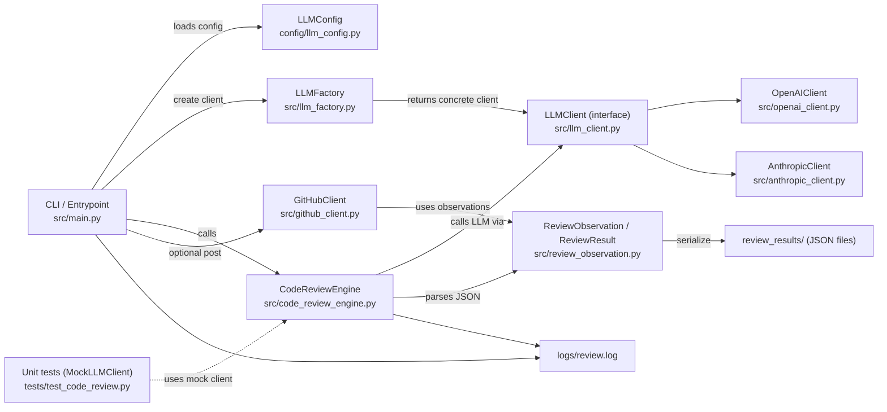

// ...existing code...
# Review Buddy — Architecture Diagram

This diagram shows the high-level architecture and data flow for the `review-runner` components in `src/`.

Notes:
- Entrypoint: [`src.main.perform_code_review`](review-runner/src/main.py) orchestrates the workflow.
- LLM creation: [`src.llm_factory.LLMFactory`](review-runner/src/llm_factory.py) returns a client implementing [`src.llm_client.LLMClient`](review-runner/src/llm_client.py) (e.g., [`src.openai_client.OpenAIClient`](review-runner/src/openai_client.py) or [`src.anthropic_client.AnthropicClient`](review-runner/src/anthropic_client.py)).
- Core analyzer: [`src.code_review_engine.CodeReviewEngine`](review-runner/src/code_review_engine.py) produces [`src.review_observation.ReviewObservation`](review-runner/src/review_observation.py) and [`src.review_observation.ReviewResult`](review-runner/src/review_observation.py).
- Optional GitHub posting: [`src.github_client.GitHubClient`](review-runner/src/github_client.py).
- Config is read from [`config.llm_config.LLMConfig`](review-runner/config/llm_config.py).
- Unit tests use a `MockLLMClient` in [`review-runner/tests/test_code_review.py`](review-runner/tests/test_code_review.py).